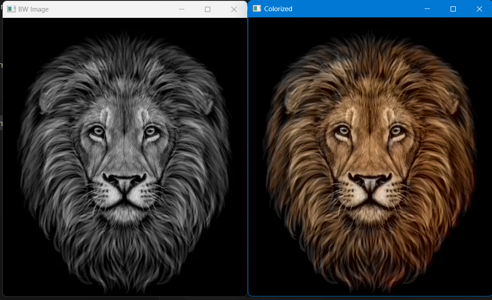

<h1 align="center">🎨 Image Colorization</h1>

<p align="center">
  
</p>

---

<p align="center">  </p>


## 📌 Project Overview

This project demonstrates **automatic colorization of black-and-white images** using a **pre-trained deep learning model** in OpenCV.
The model predicts realistic colors for grayscale images using the LAB color space:

* **L channel** → Lightness (grayscale information)
* **a, b channels** → Color information predicted by the model

The final output is a fully colorized image that closely resembles the original colored version.

---

## 🧠 How It Works

1. **Load the model**: Pre-trained Caffe model with `.prototxt` (architecture) and `.caffemodel` (weights).
2. **Load color cluster centers**: `pts_in_hull.npy` contains 313 quantized color points for prediction.
3. **Process image**: Convert grayscale image to LAB format and extract the L channel.
4. **Forward pass**: Feed L channel into the model to predict a,b channels.
5. **Merge channels**: Combine predicted a,b channels with original L channel.
6. **Convert to BGR**: Convert LAB back to BGR format for viewing.

---

## ⚙️ Setup

1. Install dependencies:

```bash
pip install opencv-python numpy
```

2. Clone/download the model files into `models/`:

* `colorization_deploy_v2.prototxt`
* `colorization_release_v2.caffemodel`
* `pts_in_hull.npy`

3. Place your grayscale images into the `images/` folder.

---

## 🖥️ Usage

```bash
python colorization.py
```

* The script will display two windows:

  * **Black & White Image**
  * **Colorized Image**
* Press any key to close the windows.

---

## 🖼️ Output Samples

**Image 1**



**Image 2**


---

## 💡 Key Concepts

* **LAB Color Space**: Separates lightness (L) from color (a,b).
* **Deep Neural Network (DNN)**: Uses pre-trained weights to predict realistic colors.
* **OpenCV DNN module**: Lightweight inference engine, no need for TensorFlow/PyTorch.

---

## 📂 File Structure

```
project/
│
├── models/
│   ├── colorization_deploy_v2.prototxt
│   ├── colorization_release_v2.caffemodel
│   └── pts_in_hull.npy
│
├── images/
│   ├── black_and_white_1.jpg
│   └── black_and_white_2.jpg
│
├── colorization.py
└── README.md
```
